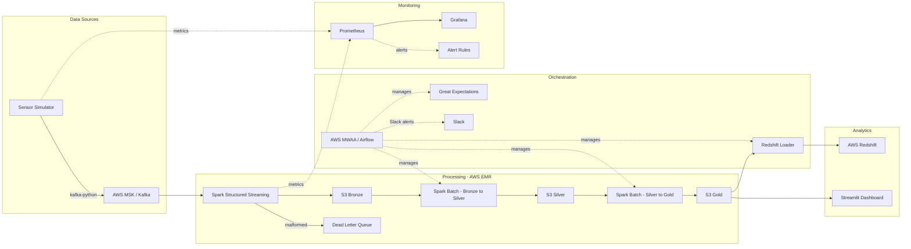

# IoT Streaming ETL Pipeline & Analytics

A production-grade data engineering pipeline processing simulated IoT sensor data through a real-time streaming architecture on AWS.

## Quick Start

```bash
# Clone and install
git clone <repo-url> && cd streaming-etl-pipeline
pip install -e ".[dev]"

# Start all services (Kafka, Spark, Airflow, Grafana, Prometheus)
docker-compose up -d

# Run the sensor producer (continuous mode)
python -m src.producers.sensor_simulator --bootstrap-servers localhost:9092

# Run tests
pytest tests/ -v --cov=src

# Lint
ruff check src/ dags/ tests/

# Open analytics dashboard
streamlit run src/dashboard/app.py
```

## Architecture



## Tech Stack

| Component        | Technology                         |
|------------------|------------------------------------|
| Language         | Python 3.11+                       |
| Streaming        | Apache Kafka (AWS MSK)             |
| Processing       | PySpark 3.5 Structured Streaming   |
| Orchestration    | Apache Airflow 2.8 (AWS MWAA)     |
| Data Lake        | AWS S3 (Bronze / Silver / Gold)    |
| Warehouse        | AWS Redshift Serverless            |
| Data Quality     | Great Expectations                 |
| Monitoring       | Prometheus + Grafana               |
| Analytics        | Streamlit Dashboard                |
| Infrastructure   | Terraform, Docker Compose          |
| CI/CD            | GitHub Actions                     |

## Key Metrics

| Metric | Target | Description |
|--------|--------|-------------|
| Throughput | 100+ events/sec | Sensor events produced per second |
| Latency | < 60s p95 | End-to-end processing latency |
| Consumer Lag | < 10,000 | Maximum Kafka consumer lag |
| Quality Pass Rate | > 99% | Data quality validation success rate |
| Anomaly Rate | ~2% | Injected anomaly rate for testing |
| Sensor Health | > 90% | % of expected readings received per sensor |

## Data Flow

1. **Sensor Simulator** generates realistic IoT events (temperature, humidity, pressure, vibration) and publishes to Kafka with configurable anomaly injection (default 2%)
2. **Spark Structured Streaming** reads from Kafka with 10-minute watermarking, parses JSON, routes malformed events to dead-letter queue, writes valid Parquet to **S3 Bronze**
3. **Bronze-to-Silver** transformation deduplicates, validates nulls, flags anomalies (range-based + z-score rolling window), adds data lineage columns (source_file, pipeline_version, processing_timestamp)
4. **Silver-to-Gold** aggregation computes 5-minute windowed stats (avg/min/max/p50/p95/p99, sensor health %), hourly location aggregations with sensor counts, and daily summaries with anomaly counts
5. **Redshift Loader** performs idempotent COPY from Gold into analytics warehouse
6. **Great Expectations** validates data quality at each layer
7. **Airflow** orchestrates the pipeline with SLA monitoring, data freshness checks, Slack failure notifications, and daily summary emails
8. **Prometheus + Grafana** provide real-time monitoring with alert rules for consumer lag, producer downtime, quality failures, and high latency
9. **Streamlit Dashboard** provides interactive analytics: real-time overview, sensor trends, location heatmap, anomaly timeline, and pipeline health

## Project Structure

```
src/producers/          Kafka producer (sensor simulator with anomaly injection, CSV replay)
src/consumers/          PySpark streaming consumer (watermarking, dead-letter queue)
src/transformations/    Bronze-to-Silver (z-score anomaly, lineage), Silver-to-Gold (percentiles, health)
src/loaders/            Redshift COPY loader + DDL
src/quality/            Great Expectations integration
src/dashboard/          Streamlit analytics dashboard (5 pages)
dags/                   Airflow DAGs (streaming + batch with validation, Slack, SLA)
great_expectations/     GE config and expectation suites
monitoring/             Grafana dashboards, Prometheus config + alert rules
terraform/              AWS infrastructure as code
tests/                  Unit and integration tests
docs/                   Demo guide, interview prep, architecture, teardown
```

## Quick Start (Local Development)

### Prerequisites

- Docker and Docker Compose
- Python 3.11+
- (Optional) Terraform 1.6+ for AWS deployment

### Run Locally

```bash
# Start all services
docker-compose up -d

# Install Python dependencies
pip install -e ".[dev]"

# Run the sensor simulator
python -m src.producers.sensor_simulator --bootstrap-servers localhost:9092

# Batch mode: send 500 events and exit
python -m src.producers.sensor_simulator --max-events 500

# Replay historical CSV data
python -m src.producers.sensor_simulator --replay-csv data/historical.csv

# Run tests
pytest tests/ -v --cov=src

# Lint
ruff check src/ dags/ tests/
```

### Access UIs

- **Airflow:** http://localhost:8080 (admin / admin)
- **Spark Master:** http://localhost:8081
- **Grafana:** http://localhost:3000 (admin / admin)
- **Prometheus:** http://localhost:9090
- **Streamlit Dashboard:** http://localhost:8501

## AWS Deployment

```bash
cd terraform
terraform init
terraform plan
terraform apply
```

Resources provisioned:
- MSK cluster (3 brokers, kafka.t3.small)
- EMR cluster (1 master + 2 core, m5.large, Spark 3.5)
- S3 buckets with lifecycle policies (Bronze, Silver, Gold)
- Redshift Serverless namespace and workgroup
- MWAA environment with DAGs bucket

## Testing

```bash
pytest tests/ -v --cov=src --cov-report=term-missing
```

Tests cover:
- Event generation schema and value ranges (producer)
- Transformation logic (dedup, anomaly flagging, windowed aggregations)
- Redshift loader SQL generation and idempotency
- Great Expectations pass/fail on known data
- Integration tests (full pipeline flow, edge cases)

## Monitoring & Alerting

The Grafana dashboard provides real-time visibility into:
- Kafka consumer lag with thresholds
- Events processed per minute by sensor type
- Processing latency percentiles (p50/p95/p99)
- Anomaly injection rate
- S3 write status
- Data quality pass/fail rate
- Dead-letter queue size
- Throughput vs lag correlation

Prometheus alert rules fire on:
- Consumer lag > 10,000 for 5 minutes
- Producer down (zero events for 2 minutes)
- Data quality failures
- Processing latency p95 > 60 seconds

## Documentation

- **[Demo Guide](docs/DEMO.md)** -- Step-by-step local demo walkthrough
- **[Architecture](docs/ARCHITECTURE.md)** -- Component descriptions, data flow, design decisions
- **[Interview Prep](docs/INTERVIEW_PREP.md)** -- 28 Q&A pairs covering all pipeline aspects
- **[Teardown](docs/TEARDOWN.md)** -- AWS resource cleanup instructions

## License

MIT
