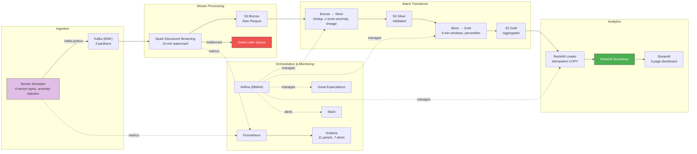
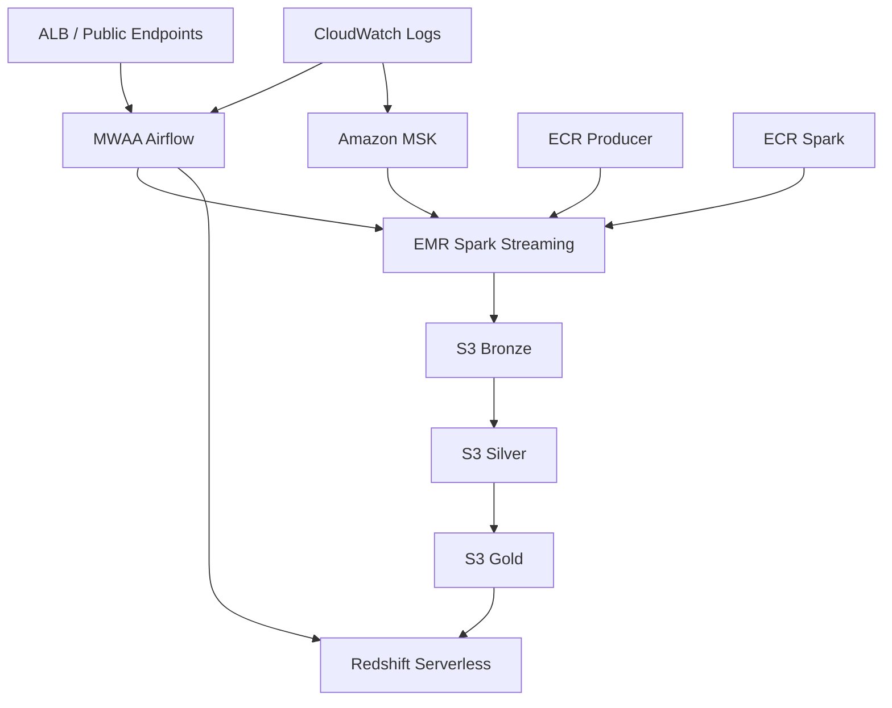

<p align="center">
  <h1 align="center">Real-Time IoT Streaming ETL Pipeline</h1>
  <p align="center">
    Production-grade data engineering — from simulated sensor events at 100+ msg/sec through Kafka, Spark, and a medallion data lake to a Redshift analytics warehouse, orchestrated by Airflow with full observability.
  </p>
</p>

<br/>

<p align="center">
  
  
  
  
  
  
  
</p>

---

## The Problem

IoT deployments generate massive volumes of sensor data that's worthless sitting in raw form. The engineering challenge: ingest high-throughput events in real-time, clean and transform them reliably, and make them queryable for analytics — all while handling late data, schema issues, and pipeline failures gracefully.

This project builds that full pipeline: **100+ events/sec ingestion**, **medallion data lake** (Bronze → Silver → Gold), **sub-60s end-to-end latency**, and **99%+ data quality pass rate** — with complete monitoring, alerting, and orchestration.

## Architecture



## Key Metrics

| Metric | Target | What It Proves |
|:-------|:-------|:---------------|
| **Throughput** | 100+ events/sec | Pipeline handles real-world IoT volume |
| **End-to-end latency** | < 60s p95 | Near real-time availability in warehouse |
| **Consumer lag** | < 10,000 | Processing keeps pace with ingestion |
| **Data quality** | > 99% pass | Validated at every layer via Great Expectations |
| **Sensor health** | > 90% | Detects silent failures (sensors stop reporting) |
| **Anomaly detection** | ~2% rate | Z-score + range-based, catches real-world drift |

## How It Works

### 1. Ingestion — Sensor Simulator → Kafka

The producer generates realistic IoT events across 4 sensor types with Gaussian noise, configurable anomaly injection (spikes at 3x normal), and Prometheus counters for observability.

```python
# Continuous mode: 100 events/sec with 2% anomaly rate
python -m src.producers.sensor_simulator --rate 100 --anomaly-rate 0.02

# Batch mode: send exactly 5000 events
python -m src.producers.sensor_simulator --max-events 5000

# Replay historical data from CSV
python -m src.producers.sensor_simulator --replay-csv data/historical.csv
```

### 2. Stream Processing — Spark Structured Streaming

Reads from Kafka, parses JSON with schema enforcement, applies 10-minute watermarking for late data, routes malformed events to a dead-letter S3 path, writes valid records as partitioned Parquet to Bronze.

### 3. Medallion Transforms

| Layer | What Happens | Key Operations |
|:------|:-------------|:---------------|
| **Bronze → Silver** | Cleaning + validation | Deduplicate on `(sensor_id, timestamp)`, null filtering, z-score rolling window anomaly detection (threshold=3σ), data lineage columns |
| **Silver → Gold** | Aggregation | 5-minute windowed stats (avg/min/max/p50/p95/p99), sensor health %, hourly location rollups, daily summaries with anomaly counts |

### 4. Loading — Idempotent Redshift COPY

Delete-then-insert by time window partition. Star schema with `fact_sensor_readings` (DISTKEY: sensor_id, SORTKEY: window_start), `dim_sensors`, and `dim_time`.

### 5. Orchestration — Airflow DAGs

| DAG | Schedule | Tasks |
|:----|:---------|:------|
| `streaming_pipeline_dag` | Daily | Ensure streaming job → Bronze→Silver → Silver→Gold → Quality checks → Load Redshift → Slack notification |
| `batch_pipeline_dag` | Manual | Historical backfill with configurable date range, validation between each stage, temp file cleanup |

Both DAGs include SLA monitoring, data freshness sensors (30-min threshold), and Slack webhook alerts on failure.

### 6. Monitoring — Prometheus + Grafana

**11 dashboard panels**: consumer lag, throughput, latency percentiles (p50/p95/p99), anomaly rate, dead-letter queue size, S3 write status, data quality pass/fail, throughput-vs-lag correlation, deployment annotations.

**7 alert rules**: consumer lag spike, producer down, quality failures, high latency, anomaly rate surge, S3 write failures, Airflow task failures.

## Tech Stack — Why These Tools

| Choice | Rationale |
|:-------|:----------|
| **Kafka** over SQS/Kinesis | Replay capability, consumer groups, industry standard for streaming |
| **Spark Structured Streaming** over Flink | Python-native (PySpark), same engine for batch + stream, dominant ecosystem |
| **S3 medallion** over direct-to-warehouse | Decouples storage from compute, enables reprocessing, cost-efficient at scale |
| **Redshift Serverless** over Snowflake | Stays within AWS ecosystem, auto-pause saves cost, COPY from S3 is native |
| **Airflow** over Step Functions | DAG-as-code, rich operator library, industry standard for data orchestration |
| **Great Expectations** over custom checks | Declarative expectations, generates docs, integrates with Airflow |
| **Terraform** over CloudFormation | Multi-cloud portable, better state management, larger community |

## Quick Start

### Prerequisites

- Docker and Docker Compose
- Python 3.11+

### Run locally

```bash
git clone https://github.com/jmahotiedu/streaming-etl-pipeline.git
cd streaming-etl-pipeline
pip install -e ".[dev]"

# Start the full stack
docker-compose up -d

# Verify services
docker-compose ps

# Start producing events
python -m src.producers.sensor_simulator --bootstrap-servers localhost:9092

# Run tests (67 pass)
pytest tests/ -v --cov=src

# Open dashboards
# Airflow    → http://localhost:8080  (admin/admin)
# Grafana    → http://localhost:3000  (admin/admin)
# Spark UI   → http://localhost:8081
# Prometheus → http://localhost:9090
# Analytics  → streamlit run src/dashboard/app.py
```

## Cloud Deployment

### AWS Topology



### Deploy / Teardown Workflow

Terraform now uses remote state in S3 with DynamoDB locking (bootstrapped by script).
`scripts/deploy.sh` includes a preflight guard for EMR, MWAA, and Redshift Serverless account access.

```bash
# Full stack plan + apply (requires service entitlement for EMR/MWAA/Redshift)
export REDSHIFT_ADMIN_PASSWORD='replace-with-strong-password'
./scripts/deploy.sh

# Plan only dry run
APPLY=false ./scripts/deploy.sh

# Core mode (MSK + S3 + ECR + networking only; no EMR/MWAA/Redshift)
DEPLOY_CORE_ONLY=true ./scripts/deploy.sh

# Core mode dry run
DEPLOY_CORE_ONLY=true APPLY=false ./scripts/deploy.sh

# Optional: bypass service entitlement preflight guard
SKIP_SERVICE_PREFLIGHT=true ./scripts/deploy.sh

# Core smoke verification (MSK ACTIVE + bronze S3 write/delete)
./scripts/core-smoke.sh

# Teardown (keep state backend)
./scripts/teardown.sh

# Teardown core mode resources
DEPLOY_CORE_ONLY=true ./scripts/teardown.sh

# Optional: teardown infra + remote state backend
DESTROY_STATE_BACKEND=true ./scripts/teardown.sh
```

Manual CI deploy path:
- GitHub Actions: `.github/workflows/terraform-deploy.yml` (`workflow_dispatch`).
- Unified multi-project teardown script: `~/projects/scripts/teardown-all.sh`.

Estimated running cost (continuous): about `$120-$280/month` depending on runtime and usage.
- Core mode estimated running cost: about `$25-$70/month` (mostly MSK + networking).

### Deployment Evidence

- Dry-run plan executed on `2026-02-18` via `scripts/deploy.sh` (`APPLY=false`).
- Result: `Plan: 54 to add, 0 to change, 0 to destroy`.
- State backend bootstrap confirmed:
  - S3 state bucket created
  - DynamoDB lock table created
- Live apply attempted on `2026-02-18` (`APPLY=true`) and failed with `SubscriptionRequiredException` for:
  - EMR
  - MWAA
  - Redshift Serverless
- Partial resources were immediately torn down via `scripts/teardown.sh` on `2026-02-18`.
- Deploy script now fails fast on missing service entitlement before Terraform apply to avoid partial paid resource creation.
- Core mode apply path (`DEPLOY_CORE_ONLY=true`) is available for demos while service entitlement is pending.
- Core verification command: `./scripts/core-smoke.sh`.

## Project Structure

```
src/
├── producers/
│   └── sensor_simulator.py   # 4 sensor types, anomaly injection, CSV replay, Prometheus metrics
├── consumers/
│   └── spark_streaming.py    # Structured Streaming, watermark, dead-letter, configurable trigger
├── transformations/
│   ├── bronze_to_silver.py   # Dedup, null filter, z-score anomaly, lineage columns
│   └── silver_to_gold.py     # Windowed aggs (p50/p95/p99), sensor health, daily summaries
├── loaders/
│   ├── redshift_schema.sql   # Star schema DDL (fact + dimensions)
│   └── redshift_loader.py    # Idempotent COPY with delete-then-insert
├── quality/
│   └── expectations.py       # Great Expectations runner for Bronze + Silver
└── dashboard/
    └── app.py                # 5-page Streamlit: overview, trends, heatmap, anomalies, health

dags/
├── streaming_pipeline_dag.py # Daily orchestration with SLA, freshness, Slack
└── batch_pipeline_dag.py     # Backfill with validation + cleanup

monitoring/
├── grafana/dashboards/       # 11-panel pipeline health dashboard
└── prometheus/               # Scrape config + 7 alert rules

terraform/                    # MSK, EMR, S3, Redshift, MWAA — full IaC
tests/                        # 67 tests (unit + integration)
docs/                         # Demo, architecture, interview prep, teardown
```

## Testing

```
67 passed in 0.63s
```

| Suite | Tests | Covers |
|:------|------:|:-------|
| `test_producer.py` | 15 | Event schema, value ranges, serialization, anomaly injection |
| `test_transformations.py` | 12 | Dedup, anomaly flagging, windowed aggregations |
| `test_loader.py` | 9 | SQL generation, idempotency, schema validation |
| `test_quality.py` | 13 | GE expectations pass/fail on known data |
| `test_integration.py` | 18 | Full pipeline flow, edge cases, late data, empty frames |

## What I'd Do Differently / Next

- **Apache Flink** for true exactly-once streaming (Spark micro-batch adds latency)
- **Delta Lake** / Iceberg for ACID transactions on the data lake
- **Debezium CDC** for real database source instead of simulated events
- **ML anomaly detection** in-stream (isolation forest on rolling windows)
- **Data lineage UI** with OpenLineage / Marquez integration
- **Kubernetes** (EKS) for container orchestration instead of standalone EMR

## Documentation

| Doc | Description |
|:----|:------------|
| [Demo Guide](docs/DEMO.md) | 13-step walkthrough for live demos |
| [Architecture](docs/ARCHITECTURE.md) | Component descriptions, data flow, design decisions, scaling |
| [Interview Prep](docs/INTERVIEW_PREP.md) | 28 Q&A pairs — Kafka, Spark, Airflow, exactly-once, scaling |
| [Teardown](docs/TEARDOWN.md) | AWS resource cleanup with billing verification |

## License

MIT
